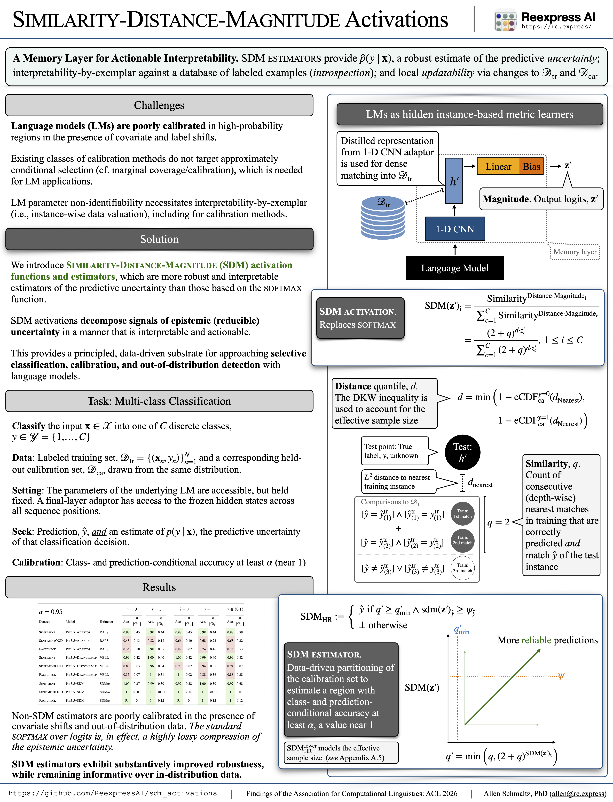

# SDM Activations and SDM Language Models research repo

### Video overview: [Here](https://youtu.be/bKswgsyRAPo)

[](https://youtu.be/bKswgsyRAPo)

## Overview

This repo includes support code and replication scripts for the papers "Similarity-Distance-Magnitude Activations" and "Similarity-Distance-Magnitude Language Models". This repo only includes auxiliary code (e.g., for preprocessing the research datasets) and scripts containing the parameters used for the experiments. The **main code** is in the [Reexpress MCP Server repo](https://github.com/ReexpressAI/reexpress_mcp_server). For reference, the provided replication scripts used version 2.0.0 (Commit 78c8465), but we generally recommend using the most recent release for new applications and research. The preprocessed data is available in the GitHub release binaries in *this* repo.

## Installation

Create the conda environment in [INSTALL.md](documentation/setup/INSTALL.md). In our provided scripts, we assume Linux and CUDA GPUs, but the scripts should also work on cpu, or on Apple silicon ('mps'), if you install an applicable version of FAISS and adjust the command line options for the device, accordingly. 

## Experiments

### "Similarity-Distance-Magnitude Activations"

Scripts for training and testing the models in the main text are in the [sdm_activations_paper directory](documentation/scripts/sdm_activations_paper/models).

[README_auxiliary_experiments.md](documentation/scripts/sdm_activations_paper/aux_experiments/README_auxiliary_experiments.md) provides some auxiliary experiments (along with replication code/scripts) to further demonstrate aspects of the behavior of SDM activations and estimators.

### "Similarity-Distance-Magnitude Language Models"

Scripts for training and testing the models are in the [sdm_lms_paper directory](documentation/scripts/sdm_lms_paper/models).

*Work in progress: Larger scale experiments and models are in development.*

### Papers

For convenience, a copy of each of the papers is included in the [papers directory](papers). The copy of "Similarity-Distance-Magnitude Activations" is the current version on arXiv (v5 is the same as v4, other than some minor typos corrected). The copy of "Similarity-Distance-Magnitude Language Models" has some minor copyediting improvements relative to the current arXiv version, but it has the same content.

### Presentations

A recording of the ACL Findings 2026 video presentation for "Similarity-Distance-Magnitude Activations" is available [here](https://youtu.be/bKswgsyRAPo), and the presentation slides are [here](papers/presentations/sdm_activations/ACL_2026_Find-3358.presentation.pdf). A PDF of the poster is [here](papers/presentations/sdm_activations/ACL_2026_Find-3358.poster.pdf).

## Citations

To appear in *Findings of the Association for Computational Linguistics: ACL 2026*, San Diego, CA, USA:

```
@misc{Schmaltz-2025-SimilarityDistanceMagnitudeActivations,
      title={Similarity-Distance-Magnitude Activations}, 
      author={Allen Schmaltz},
      year={2025},
      eprint={2509.12760},
      archivePrefix={arXiv},
      primaryClass={cs.LG},
      url={https://arxiv.org/abs/2509.12760},
      note={To appear in \emph{Findings of the Association for Computational Linguistics: ACL 2026}, San Diego, CA, USA.},
}
```

Pre-print (work in progress):

```
@misc{Schmaltz-2025-SimilarityDistanceMagnitudeLanguageModels,
      title={Similarity-Distance-Magnitude Language Models}, 
      author={Allen Schmaltz},
      year={2025},
      eprint={2510.26183},
      archivePrefix={arXiv},
      primaryClass={cs.CL},
      url={https://arxiv.org/abs/2510.26183}, 
}
```
