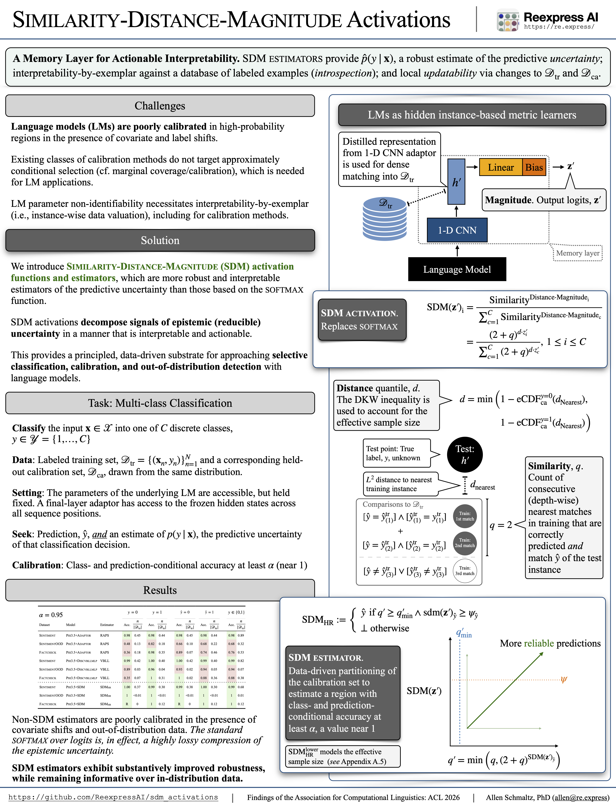

# SDM Activations and SDM Language Models research repo

### Video overview: [Here](https://youtu.be/bKswgsyRAPo)

[](https://youtu.be/bKswgsyRAPo)

## Overview

This repo includes support code and replication scripts for the papers "Similarity-Distance-Magnitude Activations" and "Similarity-Distance-Magnitude Language Models". This repo only includes auxiliary code (e.g., for preprocessing the research datasets) and scripts containing the parameters used for the experiments. The **research code** is in the [Reexpress MCP Server repo](https://github.com/ReexpressAI/reexpress_mcp_server). The preprocessed embeddings are available in the GitHub release binaries in *this* repo for purposes of replicating results.

**For new applications and research, we recommend using the Apache-2.0 Python package [reexpress-sdm](https://pypi.org/project/reexpress-sdm/).**

## Changelog

### Update October 5, 2026:

The research note on nested SDM estimators has been incorporated into v6 of the arXiv copy of "Similarity-Distance-Magnitude Activations" as Appendix A.10.

We recommend that new applications of SDM estimators use the Apache-2.0 Python package [reexpress-sdm](https://pypi.org/project/reexpress-sdm/).

### Update August 28, 2026:

Release v2.4.1 of the Reexpress MCP Server is the latest release that includes the code for replicating the baseline adaptors, as well as the original LM post-training code for Phi-3.5. When using SDM estimators for new projects, we recommend using the streamlined codebase starting in release v2.5.0. The SDM estimator behavior is the same, but the new version also implements [nested estimators](https://raw.githubusercontent.com/ReexpressAI/sdm_activations/main/research_notes/nested_sdm_estimators.pdf), which are useful in practice for ranking the relative probability of points outside the High-Reliability region. Using the newer version is largely the same, with some minor changes and additions to the command-line interface. For reference, the directory [v2.5.0_code_examples](documentation/scripts/sdm_activations_paper/v2.5.0_code_examples) includes representative usage examples. (Separately, the LM post-training code will eventually have its own dedicated repo, coinciding with the release of a revised version of "Similarity-Distance-Magnitude Language Models".)

## Installation

See [https://pypi.org/project/reexpress-sdm/](https://pypi.org/project/reexpress-sdm/). (Legacy research code is alternatively available in the repos noted above.)

## Experiments

### "Similarity-Distance-Magnitude Activations"

Scripts for training and testing the models in the main text are in the [sdm_activations_paper directory](documentation/scripts/sdm_activations_paper/models).

[README_auxiliary_experiments.md](documentation/scripts/sdm_activations_paper/aux_experiments/README_auxiliary_experiments.md) provides some auxiliary experiments (along with replication code/scripts) to further demonstrate aspects of the behavior of SDM activations and estimators.

### "Similarity-Distance-Magnitude Language Models"

Scripts for training and testing the models are in the [sdm_lms_paper directory](documentation/scripts/sdm_lms_paper/models).

*Work in progress: Larger scale experiments and models are in development. (See the changelog from August 28, 2026. This work will be moved to a dedicated repo in the future.)*

### Papers

For convenience, a copy of each of the papers is included in the [papers directory](papers). The copy of "Similarity-Distance-Magnitude Activations" is the current version on [arXiv](http://arxiv.org/abs/2509.12760) (v6 adds Appendix A.10 and Alg. 2, which describe nested SDM estimators as implemented in the publicly available code). The copy of "Similarity-Distance-Magnitude Language Models" has some minor copyediting improvements relative to the current arXiv version, but it has the same content.

### Presentations

A recording of the ACL Findings 2026 video presentation for "Similarity-Distance-Magnitude Activations" is available [here](https://youtu.be/bKswgsyRAPo), and the presentation slides are [here](papers/presentations/sdm_activations/ACL_2026_Find-3358.presentation.pdf). A PDF of the poster is [here](papers/presentations/sdm_activations/ACL_2026_Find-3358.poster.pdf).

## Citations

Appearing in *Findings of the Association for Computational Linguistics: ACL 2026*, San Diego, CA, USA:

```
@inproceedings{Schmaltz-2026-SimilarityDistanceMagnitudeActivations,
    title = "Similarity-Distance-Magnitude Activations",
    author = "Schmaltz, Allen",
    editor = "Liakata, Maria  and
      Moreira, Viviane P.  and
      Zhang, Jiajun  and
      Jurgens, David",
    booktitle = "Findings of the {A}ssociation for {C}omputational {L}inguistics: {ACL} 2026",
    month = jul,
    year = "2026",
    address = "San Diego, California, United States",
    publisher = "Association for Computational Linguistics",
    url = "https://aclanthology.org/2026.findings-acl.1109/",
    doi = "10.18653/v1/2026.findings-acl.1109",
    pages = "22037--22057",
    ISBN = "979-8-89176-395-1",
    abstract = "We introduce the Similarity-Distance-Magnitude (SDM) activation function, a more robust and interpretable formulation of the standard softmax activation function, adding Similarity (i.e., correctly predicted depth-matches into training) awareness and Distance-to-training-distribution awareness to the existing output Magnitude (i.e., decision-boundary) awareness, and enabling interpretability-by-exemplar via dense matching. We further introduce the SDM estimator, based on a data-driven partitioning of the class-wise empirical CDFs via the SDM activation, to control the class- and prediction-conditional accuracy among selective classifications. When used as the final-layer activation over pre-trained language models for selective classification, the SDM estimator is more robust to covariate shifts and out-of-distribution inputs than existing calibration methods using softmax activations, while remaining informative over in-distribution data."
}
```

Pre-print (work in progress):

```
@misc{Schmaltz-2025-SimilarityDistanceMagnitudeLanguageModels,
      title={Similarity-Distance-Magnitude Language Models}, 
      author={Allen Schmaltz},
      year={2025},
      eprint={2510.26183},
      archivePrefix={arXiv},
      primaryClass={cs.CL},
      url={https://arxiv.org/abs/2510.26183}, 
}
```
